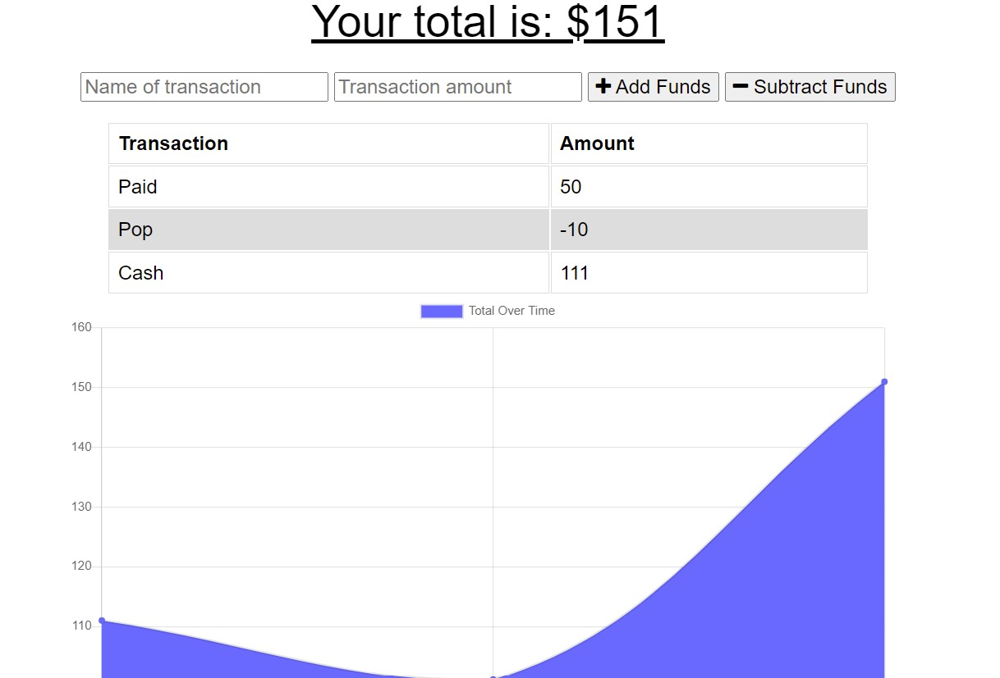
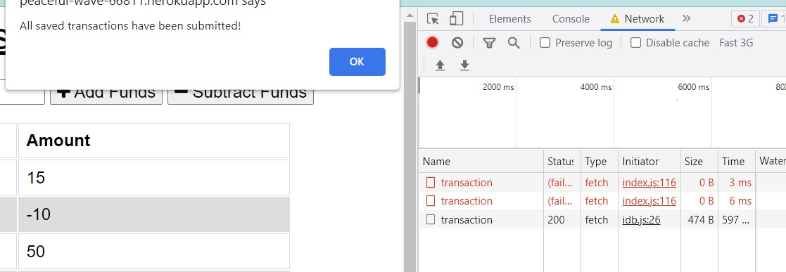

# Budget Tracker

# User Story
AS AN avid traveler
I WANT to be able to track my withdrawals and deposits with or without a data/internet connection
SO THAT my account balance is accurate when I am traveling 

## Description
This is a website that can be used to track transactions and current balance, even when there is no internet connection.

## Homepage
The homepage of this application displays all of the transactions that have happened, a graph of the total over time, as well as the current total at the top of the screen.

## Offline Support
When the user does not have internet access, they can still update their totals and add transactions, however the fetch request will fail. It will save locally, and once connected to internet again, it will send to the server to update.

## Link to Site
Here is the live site on Heroku: https://peaceful-wave-66811.herokuapp.com/

## Built With
This program uses the following:
* Javascript (including PWA, service workers, and IndexedDB)
